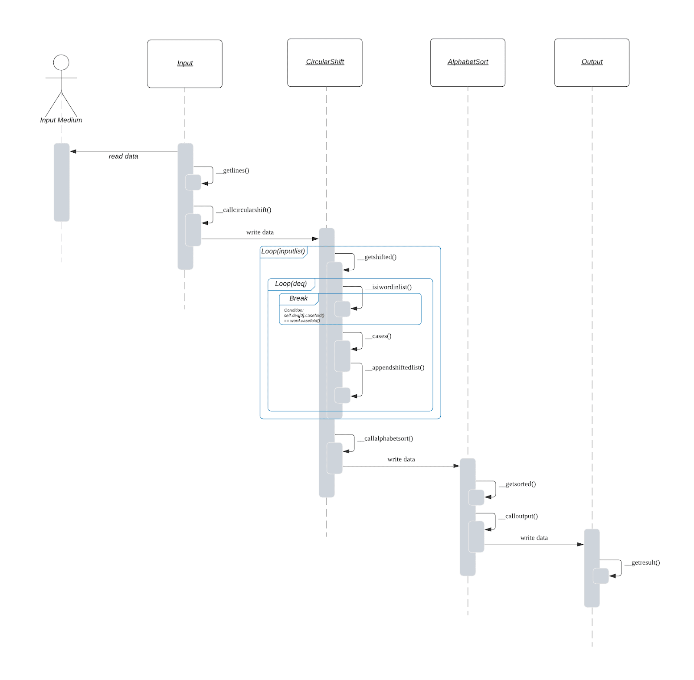
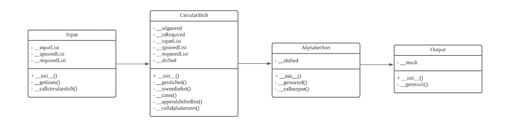
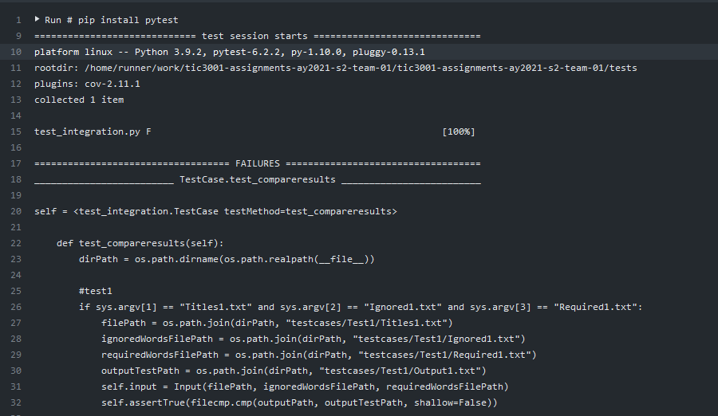
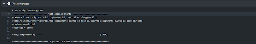

# tic3001-assignments-ay2021-s2-team-01

Author: Lim Kang, Ng Xin Yi


## Introduction

This assignment is to implement a KWIC (Key Word In Context) index system. The system accepts an ordered set of lines, each line is an ordered set of word, and each word is an ordered set of characters. For each line, it shall be “circularly shifted” exhaustively by removing the first word and appending it at the end of the line to create a set of circularly shifted lines and outputs a listing of all circularly shifted lines in alphabetical order.

These are the following 2 architectural designs that we have implemented for the KWIC system.

 - Requirement 1 (“words to ignore”) – Ng Xin Yi
 - Requirement 2 (“required words”) - Lim Kang
 - CI - Lim Kang


## Functional Requirements

| S/N | Functional Requirements  |
|--|--|
| 1 | To implement a KWIC (Key Word in Context) index system |
| 2 | The user input information in a long list of lines such as book title into input.txt file |
| 3 | For each input line, it shall be “circularly shifted” exhaustively by removing the last word and appending it at the first of the line too create a set of circularly shifted lines.|
| 4 | The KWIC index system shall output on the screen a listing of the circularly shifted lines for all the input lines in ascending alphabetical order which will be also saved into output.txt file|


| S/N | Non-Functional Requirement |
|--|--|
| 1 | The system should be very easy for users to use the system|
| 2 | The system should respond to user’s query in a reasonable time|
| 3 | New functions can be added to the system easily without any major change to design of the system|


## Architectural Design

Based on the 2 architecture designs that we have implemented in Assignment 1 - Abstract Data Type and Pipe and Filter solutions, we have chosen Pipe and Filter solution for the extended design.

The Pipe and Filter solution is an architectural design pattern that allows for stream/asynchronous processing. It connects several components, which are referred to as filters that process a stream of data, each connected to the next component in the processing pipeline via a pipe. 

If new steps are introduced into a process, it would be possible to create separate filters for those new steps. Therefore, it would be easy to grow the pipe and filter architecture. It also makes it easy to reuse filters that perform a generic action on various data sets. Another advantage is that filters don't share their state and are unaware of what other filters are doing. They only communicate through their input/output channels which reduces coupling between components.

As for Abstract Data Type, the solution is not particularly well suited to enhancements. The main problem is that to add new functions to the system, the implementor must either modify the existing modules, compromising their simplicity and integrity or add new modules that lead to performance penalties.

For this design it consists of 4 components – Input, CircularShift, AlphabetSort, Output.
 - **Input** reads all the lines from **Input Medium** which is a text file that the user input the data.
 - **Input** calls its function getlines() to return all the lines from the text file and call callcircularshift() to pass the data to **CircularShift**.
 - **CircularShift** calls its function getshifted() and run a loop for inputList and within the loop, it runs another loop for deq and call iswordinlist() to perform
 check if the word is existing in ignoreList and requiredList, and after the check is completed and updated, it then calls cases(), if it hits one of the if else
 condition scenarios, it will call appendshiftedlist() to append the line to a list. After all the lines have been circular shifted, CircularShift calls and passe
 the data to **AlphabetSort**.
 - **AlphabetSort** calls its function getsorted() to perform alphabetical sort. After all the lines have been alphabetically sorted, it calls calloutput() to pas
 the data to **Output**.
 - **Output** calls its function getresult() to write it in a text file.

These actions are illustrated in the sequence diagram and class diagram as shown in the figure below.




The direct association (depicted as arrows) acts as a pipe to facilitate communication between modules.




## Applying Design Principles

**Basic Principles:**

 - **Information Hiding:**
 We have complete control over how the user manipulates the contents of the list. If they had public access to the top, they could change it in a way that breaks the
 properties of the list. Since the top is hidden from their access, they have no way of breaking the list, as long as our code is correct.
 
 - **High Cohesion:**
 The advantage of high cohesion is that such classes are much easier to maintain. The elements within the module are directly related to the functionality that module
 is intended to provide. 
 Another benefit of high cohesion is that classes with a well-focused purpose tend to be more reusable than other classes because the code for a module is all locate
 together and works together, we can easily design, write, and test our code.

**Object Oriented Class Design Principles:**

- **Single Responsible Principle:**
Every class or module in a program should have responsibility for just a single piece of that program’s functionality. Further, the elements of that responsibility should be encapsulated by the responsible class rather than spread out in unrelated classes. Not only are pieces of functionality encapsulated in their own classes, but they are organized in a manner that is both predictable and consistent.

- **Open Close Principle:**
A class/object should be open to extension but close for modification. If it is necessary to change a specific class because of new business requirements, it is better to create a new code for the changes or new functionality instead of affecting the existing one in the cases where it is possible.

Therefore, by applying these principles to our code, we have effectively:
 1. Modified the access control to private attributes and methods.
 2. Separated responsibilities into individual classes/methods and thus reduced the chances of code changes in one place breaking operations in another. It is also
 much nicer to work with when updates are needed.


## CI ##

These are the following reasons why we chose GitHub Actions as our continuous integration tool:
 1. It is relatively easy to use and there’s sufficient resources online to help us to fix errors.
 2. GitHub Actions's Features:
 - Multiple workflow files support
 - Free and open source
 - Workflow run interface
 - Search for actions in GitHub Marketplace
 - Integrated with Github's Checks API
 - Logs and artifacts downloading support

**Challenges Faced**
 - Trouble with linting using flake8.

**Helpful Features**
 - Automated testing and building
 - Automated checking for Syntax errors

We have created the test cases based on the test cases that were provided in Assignment 1 and 2. The test cases were based on whether the generated output was correct or wrong.
These are the following screenshots of the CI console output (Failed/Passed/Build history):

**Failed:**



**Passed**




## How to use
```
# Clone this repository

$ git clone https://github.com/TIC3001/tic3001-assignments-ay2021-s2-team-01

  
# Go into the repository

cd tic3001-assignments-ay2021-s2-team-01

edit codes and push back to repo
$ git add .
$ git commit -m "Key in Message"
$ git push origin main

Under github,
1. go to actions
2. GitHubActions which is our CI tool will automatically build & test the code when it is newly pushed

```
## Excecuting test output example

